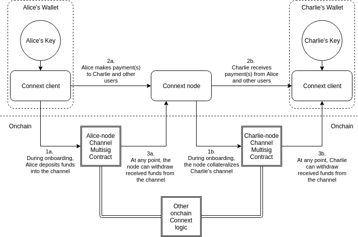

# v2.0 Architecture Overview

## Indra

[Indra](https://github.com/ConnextProject/indra) is the core implementation monorepo for Connext. Indra contains ready-for-deployment code for core node services, client, the Dai Card (as a reference implementation), as well as scripts needed to deploy and operate a node in production. When deploying a node to production, the most recent docker images will be used.

For detailed instructions on how to run the code contained within the repository see the [Running your own node](../nodeOperator/runNode.md) guide.

There are several modules contained within the indra repository:

### Client

The Connext Client package is a Typescript interface which is used to connect to a node and communicate over the Connext Network. The client package is available through [npm](https://www.npmjs.com/package/@connext/client).

Clients with their own keys are ideally integrated directly at the wallet layer. This is because they contain validator code which determines, on behalf of the user, whether a given state is safe to sign. Clients can also be used via a `connextProvider` in a frontend environment to make calls to a hooked client that is hosted in a more trusted environment such as a wallet.

Clients contain the following functionality:

* Depositing to a channel
* Installing any arbitrary application with any counterparty
* Updating applications.
* Uninstalling applications.
* Prebuilt applications for common usecases, including simple transfers and swaps.
* Withdrawing funds from a channel and automatically submitting the latest available mutually agreed update.
* Handling a dispute.
* Generating/signing/sending and validating/receiving state updates over NATS. The Client takes in the address of the server that is being used to pass messages in the constructor.

Further documentation on the client can be found [here](../user/clientAPI.md).

### Node

Nodes can be thought of as an automated implementation of the client along with services to enable client to client interactions. Nodes have the same functionality outlined above, and forward state update packets between clients.

### Contracts

Connext is built on Counterfactual's contracts. Code is fully [open source](https://github.com/counterfactual/monorepo/) and a protocol description is available [here](https://specs.counterfactual.com).

**Do not modify the contracts themselves before deploying - this could break the security model of the entire protocol**

### Database

Contains all the database migration information to be used by the docker images. Make sure that the migrations in the database module, and in the `node/migrations` folder are consistent if you are making changes here.

### Proxy

Routing proxy and related configurations.

### Dai Card

The [Dai Card](https://github.com/ConnextProject/indra/tree/master/modules/daicard) is a sample implementation of the client designed to help you bootstrap an application that integrates Connext. It contains an inpage wallet and payment interface, as well as a custom Web3 injection that automatically signs transactions using the inpage wallet. For developers just beginning to build their application, the card is a great way to get started; for developers looking to integrate with existing an existing app, it's a good instructive resource for implementation and includes some components that you can easily copy over.
